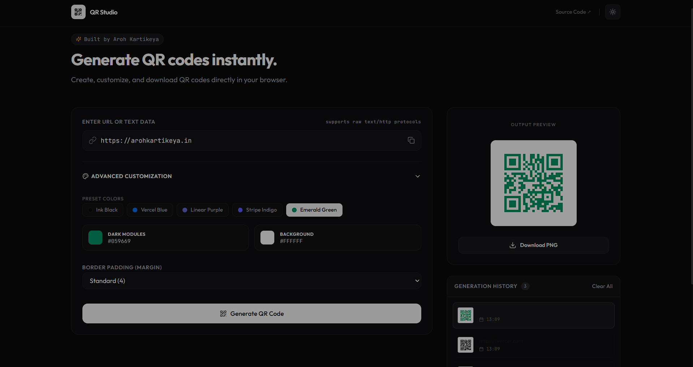

# QR Studio

A QR code generator built with React, Node.js, and Express.

Users can generate QR codes from text or URLs, customize colors, and download the generated QR code as a PNG image.

## Features

* Generate QR codes instantly
* Download QR codes as PNG
* Custom foreground and background colors
* Adjustable QR margin
* Local generation history
* Responsive design for desktop and mobile

## Tech Stack

### Frontend

* React
* Vite
* Tailwind CSS

### Backend

* Node.js
* Express
* QRCode

### Deployment

* Vercel

## Running Locally

Clone the repository:

git clone https://github.com/aroh-kartikeya/QR-Studio.git
cd qr-studio


Install dependencies:


npm install


Start the development server:


npm run dev


The application will be available at:


http://localhost:5173


## Project Structure


api/
├── index.js

src/
├── components/
├── App.jsx
├── main.jsx
└── index.css
```

## Live Demo

https://qr-studio-iota.vercel.app/

## Screenshots




## Why I Built This

I originally built a QR code generator as a simple Node.js script. Later, I rebuilt it as a full-stack web application with a React frontend and Express backend to make it easier to use and deploy online.
